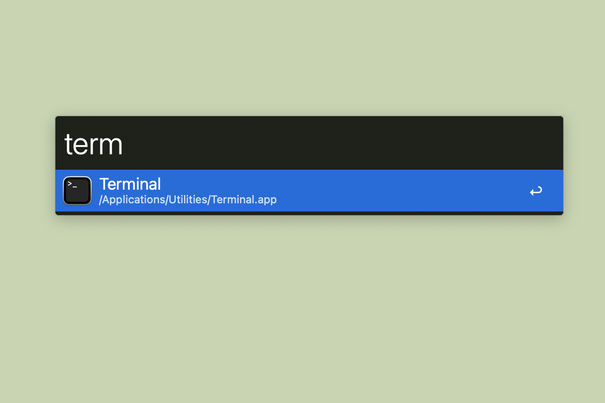

If you've ever had to do a fresh install on your computer, you know how frustrating it can be to have to go back and change all your preferences one by one. this is where **dotfiles** can save you a couple of headaches. If you're not familiar with dotfiles, they are created automatically by your OS as well as most apps that you use. They are called dotfiles because they have a dot prefix in their names. **dotfiles can be set up to automatically back (or restore) up your system preferences, installed apps, terminal preferences, and more.** Let's get started with some dotfiles basics.

### First Steps

Before we dive into this topic, I would like to thank **Patrick Mcdonald** for providing an incredible resource through his [uDemy course](https://dotfiles.eieio.xyz). His course is not only helpful for learning dotfiles, but also for learning how to navigate the terminal and understand the [shell](https://en.wikipedia.org/wiki/Shell_(computing)). This guide heavily relies on that resource and I probably wouldn't be making this if it weren't for his class. There are also many more resources that may interest you that I will link at the end of this post.

Another thing I should acknowledge is the learning curve. If you have never used terminal before this process may seem too difficult to follow. I will do my best to throughly explain what is being executed on each step. Also, if you've never used keyboard shortcuts before, just know that if you see a plus sign between two keys, for example: ```⌘ + F```, it just means to press the **⌘ key** and the **F key** together. ***Please note that these changes could cause issues with your computer so if you don't feel completely confident in your understanding of these steps I'd avise against it! (follow at your own risk)***. With that out of the way, lets get started!

### Introduction To Terminal

There are a couple of ways you can access your terminal, but the easiest way is to use **spotlight.** You can access your spotlight by using the ``⌘ + spacebar`` keyboard shortcut. Next, just type terminal and open the first result given to you by spotlight. It should look something like this:


So, now that we've opened the terminal let's get familiar with some commands.

#Work in progress... come back when im done!

```
Hello World!
```